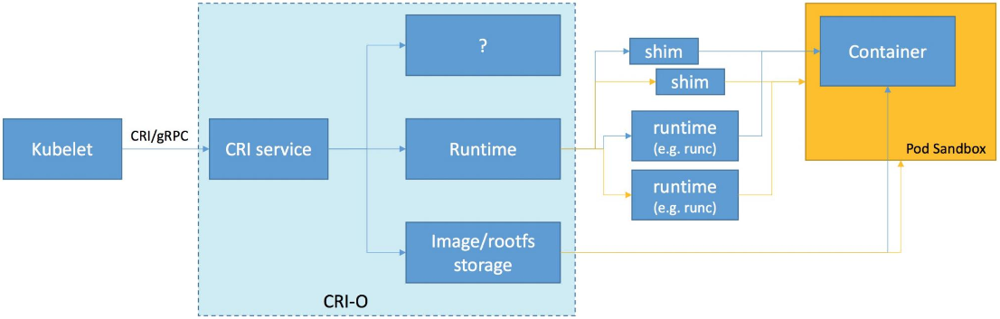

<h1 align="center">
    Kubernetes Concepts - From Zero to God
</h1>

<h1 align="center"> 
	🚧  🚀 Em construção...  🚧
</h1>

<h2 align="center">An Overview of Kubernetes Concepts</h2>

## Table of Contents
* [Basic Terminology](#basic-terminology)
* [Advanced Terminology](#advanced-terminology)
* [User space vs Kernel space](#User-space-vs-Kernel-space)
* [How user space affects your application](#How-user-space-affects-your-application)
* [Cgroup vs Namespaces](#Cgroup-vs-Namespaces)
* [Open Container Initiative Runtime Specification](#Open-Container-Initiative-Runtime-Specification)
* [Container Runtimes](#Container-Runtimes)
* [What's LXC, runC](#What's-LXC,-runC)
* [Container Engines](#Container-Engines)
* [What's Docker, Podman, CRI-O](#What's-Docker,-Podman,-CRI-O)
* [Kubernetes](#Kubernetes)
* [Plus](#plus)

## Basic Terminology
  - Container
  - Image
  - Container Image
  - Image Layer
  - Index
  - Registry
  - Repository
  - Tag
  - Base Image
  - Platform Image
  - Layer 
  - <a href="https://developers.redhat.com/blog/2016/01/13/a-practical-introduction-to-docker-container-terminology/">Link</a>

## Advanced Terminology 
  - Container Image Format
  - Container Engine - <a href="https://developers.redhat.com/blog/2018/02/22/container-terminology-practical-introduction/#h.6yt1ex5wfo3l">Link</a>
  - Container Host
  - Registry Server
  - Container Orchestration
  - Container Runtime - <a herf="https://developers.redhat.com/blog/2018/02/22/container-terminology-practical-introduction/#h.6yt1ex5wfo55">Link</a>
  - Kernel Namespace
  - Graph Driver
  - Container Use Cases
    - Application Containers
    - Operating System Containers
    - Pet Containers
    - Super Privileged Containers
  - Architecture of Containers
    - Application Images
    - Containerized  Components
    - Deployer Images
    - System Containers  
  - <a href="https://developers.redhat.com/blog/2018/02/22/container-terminology-practical-introduction/">Link</a>

## User space vs Kernel space
- Kernel Space: <a href="https://medium.com/@saschagrunert/demystifying-containers-part-i-kernel-space-2c53d6979504">Link</a>
- Understanding user space and kernel space: <a href="https://www.redhat.com/en/blog/architecting-containers-part-1-why-understanding-user-space-vs-kernel-space-matters">Link</a>

    

## How user space affects your application
- Understanding h ow user space affects your application: <a href="https://www.redhat.com/en/blog/architecting-containers-part-3-how-user-space-affects-your-application">Link</a>

    

    - A typical program gets access to resources in the kernel through layers of abstraction similar to the following diagram:
    

## Cgroup vs Namespaces
- Cgroup: Control Groups provide a mechanism for aggregating/partitioning sets of tasks, and all their future children, into hierarchical groups with specialized behaviour.
- Namespace: wraps a global system resource in an abstraction that makes it appear to the processes within the namespace that they have their own isolated instance of the global resource.

#### In short:

  - Cgroups = limits how much you can use
  - namespaces = limits what you can see (and therefore use)
    - <a href="https://pt.slideshare.net/jpetazzo/anatomy-of-a-container-namespaces-cgroups-some-filesystem-magic-linuxcon">Anatomy of a Container: Namespaces, cgroups & Some Filesystem Magic</a>

  - Cgroups involve resource metering and limiting:
    - memory
    - CPU
    - block I/O
    - network

  - Namespaces provide processes with their own view of the system:
    - pid
    - net
    - mnt
    - uts
    - ipc

## Open Container Initiative Runtime Specification
  - The Open Container Initiative develops specifications for standards on Operating System process and application containers: 
    - <a href="https://opencontainers.org/">Link</a>
    - <a href="https://github.com/opencontainers/runtime-spec/blob/master/spec.md">Link</a>

      

## Container Runtimes
  - Open Container Initiative <a herf="https://opencontainers.org/">Link</a>
  - A Comprehensive Container Runtime Comparison <a href="https://www.capitalone.com/tech/cloud/container-runtime/">Link</a>
  - Demystifying Containers: Container Runtimes <a herf="https://medium.com/@saschagrunert/demystifying-containers-part-ii-container-runtimes-e363aa378f25">Link</a>

  - What's runC? (The universal container runtime) <a href="https://www.docker.com/blog/runc/">Link</a>

#### What's LXC, Docker, Podman
  - What's LXC? (LinuX Containers) <a href="https://linuxcontainers.org/lxc/introduction/">Link</a>
  - What's Docker? <a href="https://docs.docker.com/get-started/overview/">Link</a>
  - What's Podman? <a href="https://podman.io/getting-started/">Link</a>

    

## The Container Runtime Interface
  - CRI: the Container Runtime Interface: <a href="https://github.com/kubernetes/kubernetes/blob/242a97307b34076d5d8f5bbeb154fa4d97c9ef1d/docs/devel/container-runtime-interface.md">Link</a>
  - Kubernetes Container Runtime Interface: <a href="https://www.alibabacloud.com/blog/getting-started-with-kubernetes-%7C-kubernetes-container-runtime-interface_596339">Link</a>
  - What's CRI-O? <a href="https://cri-o.io/">Link</a>
  - What's rktlet? <a href="https://github.com/kubernetes-retired/rktlet">Link</a>

    

## Container Engines
  - A container engine is a piece of software that accepts user requests, including command line options, pulls images, and from the end user’s perspective runs the container. There are many container engines, including docker, RKT, CRI-O, and LXD: <a href="https://developers.redhat.com/blog/2018/02/22/container-terminology-practical-introduction/#h.6yt1ex5wfo3l">Link</a>

  
    <a href="https://docs.google.com/presentation/d/1OpsvPvA82HJjHN3Vm2oVrqca1FCfn0PAfxGZ2w_ZZgc/edit#slide=id.g2441f8cc8d_0_80">Two Types of People - Those Who Understand Container Standards and Those That Don't</a>

#  Kubernetes
  - Kubernetes is removing docker support: <a href="https://www.openshift.com/blog/kubernetes-is-removing-docker-support-kubernetes-is-not-removing-docker-support">Link</a>

## -

# Plus

## Docker and LXD
  

## Docker Revolution
  - Docker Community Edition
  - Docker Compose
  - Docker Swarm
  - <a href="https://www.infoworld.com/article/3204171/what-is-docker-the-spark-for-the-container-revolution.html"> Link </a>

## Hello world!
   

