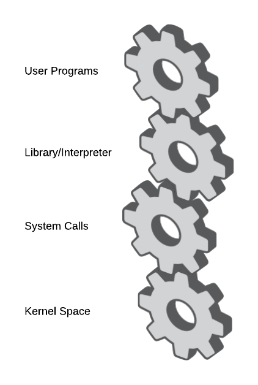
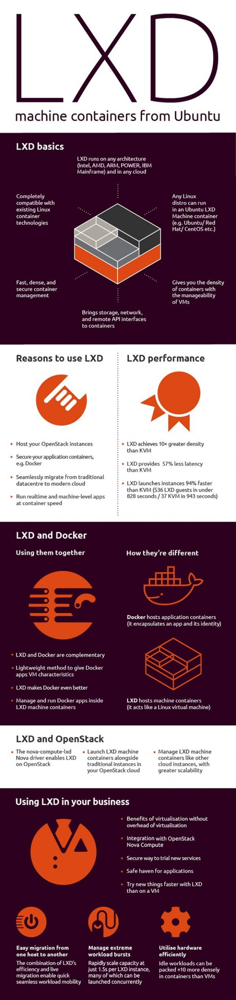

<h1 align="center">
    Kubernetes Concepts - From Zero to God
</h1>

<h1 align="center"> 
	🚧  🚀 Em construção...  🚧
</h1>

<h2 align="center">An Overview of Kubernetes Concepts</h2>

## Table of Contents
* [Basic Terminology](#basic-terminology)
* [Advanced Terminology](#advanced-terminology)
* [User space vs Kernel space](#User-space-vs-Kernel-space)
* [How user space affects your application](#How-user-space-affects-your-application)
* [Cgroup vs Namespaces](#Cgroup-vs-Namespaces)
* [Docker vs LXD vs LXC](#Docker-vs-LXD-vs-LXC)
* [Docker vs LXD](#Docker-vs-LXD)
* [Open Container Initiative Runtime Specification](#Open-Container-Initiative-Runtime-Specification)
* [Plus](#plus)

## Basic Terminology
  - Container
  - Image
  - Container Image
  - Image Layer
  - Index
  - Registry
  - Repository
  - Tag
  - Base Image
  - Platform Image
  - Layer 
  - <a href="https://developers.redhat.com/blog/2016/01/13/a-practical-introduction-to-docker-container-terminology/">Here</a>

## Advanced Terminology 
  - Container Image Format
  - Container Engine
  - Container Host
  - Registry Server
  - Container Orchestration
  - Container Runtime
  - Kernel Namespace
  - Graph Driver
  - Container Use Cases
    - Application Containers
    - Operating System Containers
    - Pet Containers
    - Super Privileged Containers
  - Architecture of Containers
    - Application Images
    - Containerized  Components
    - Deployer Images
    - System Containers  
  - <a href="https://developers.redhat.com/blog/2018/02/22/container-terminology-practical-introduction/">Here</a>

## User space vs Kernel space
- Understanding user space and kernel space : <a href="https://www.redhat.com/en/blog/architecting-containers-part-1-why-understanding-user-space-vs-kernel-space-matters">Here</a>

    

## How user space affects your application
- Understanding h ow user space affects your application: <a href="https://www.redhat.com/en/blog/architecting-containers-part-3-how-user-space-affects-your-application">Here</a>

    

    - A typical program gets access to resources in the kernel through layers of abstraction similar to the following diagram:
        

## Cgroup vs Namespaces
- Cgroup: Control Groups provide a mechanism for aggregating/partitioning sets of tasks, and all their future children, into hierarchical groups with specialized behaviour.
- Namespace: wraps a global system resource in an abstraction that makes it appear to the processes within the namespace that they have their own isolated instance of the global resource.

- In short:

  - Cgroups = limits how much you can use
  - namespaces = limits what you can see (and therefore use)
  - <a href="https://pt.slideshare.net/jpetazzo/anatomy-of-a-container-namespaces-cgroups-some-filesystem-magic-linuxcon">Anatomy of a Container: Namespaces, cgroups & Some Filesystem Magic</a>

- Cgroups involve resource metering and limiting:

  - memory
  - CPU
  - block I/O
  - network

- Namespaces provide processes with their own view of the system:

  - pid
  - net
  - mnt
  - uts
  - ipc

## Open Container Initiative Runtime Specification
 - The Open Container Initiative develops specifications for standards on Operating System process and application containers.
 - <a href="https://github.com/opencontainers/runtime-spec/blob/master/spec.md">Here</a>

https://github.com/opencontainers/runc

## Docker vs LXD vs LXC
 - What's Docker? <a href="https://docs.docker.com/get-started/overview/">Here</a>
 - What's LXC? <a href="https://linuxcontainers.org/lxc/introduction/">Here</a>
 - What's LXD? <a href="https://linuxcontainers.org/lxd/introduction/">Here</a>

 - Kubernetes is removing docker support: <a href="https://www.openshift.com/blog/kubernetes-is-removing-docker-support-kubernetes-is-not-removing-docker-support">Here</a>

## Docker vs LXD

# Plus

## Docker Revolution
- Docker Community Edition
- Docker Compose
- Docker Swarm
- <a href="https://www.infoworld.com/article/3204171/what-is-docker-the-spark-for-the-container-revolution.html"> Here </a>

