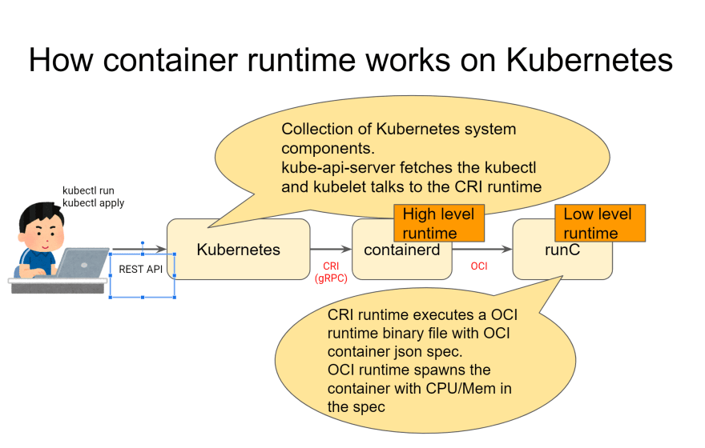

<h1 align="center">
    Kubernetes Concepts - From Zero to God
</h1>

<h1 align="center"> 
	🚧  🚀 🚀🚀🚀🚀🚀🚀🚀🚀  🚧
</h1>

<h2 align="center">An Overview of Kubernetes Concepts</h2>

## Table of Contents
* [Basic Terminology](#basic-terminology)
* [Advanced Terminology](#advanced-terminology)
* [User space vs Kernel space](#User-space-vs-Kernel-space)
* [How user space affects your application](#How-user-space-affects-your-application)
* [Cgroup vs Namespaces](#Cgroup-vs-Namespaces)
* [Open Container Initiative Runtime Specification](#Open-Container-Initiative-Runtime-Specification)
* [Container Runtimes](#Container-Runtimes)
* [What's LXC, runC](#What's-LXC,-runC)
* [Container Engines](#Container-Engines)
* [What's Docker, Podman, CRI-O](#What's-Docker,-Podman,-CRI-O)
* [Kubernetes](#Kubernetes)
* [Plus](#plus)

## Basic Terminology
  - Container
  - Image
  - Container Image
  - Image Layer
  - Index
  - Registry
  - Repository
  - Tag
  - Base Image
  - Platform Image
  - Layer 
  - <a href="https://developers.redhat.com/blog/2016/01/13/a-practical-introduction-to-docker-container-terminology/">Link</a>

## Advanced Terminology 
  - Container Image Format
  - Container Engine (High-Level container runtime) - <a href="https://developers.redhat.com/blog/2018/02/22/container-terminology-practical-introduction/#h.6yt1ex5wfo3l">Link</a>
  - Container Host
  - Registry Server
  - Container Orchestration
  - Container Runtime (Low-Level container runtime) - <a herf="https://developers.redhat.com/blog/2018/02/22/container-terminology-practical-introduction/#h.6yt1ex5wfo55">Link</a>
  - Kernel Namespace
  - Graph Driver
  - Container Use Cases
    - Application Containers
    - Operating System Containers
    - Pet Containers
    - Super Privileged Containers
  - Architecture of Containers
    - Application Images
    - Containerized  Components
    - Deployer Images
    - System Containers  
  - <a href="https://developers.redhat.com/blog/2018/02/22/container-terminology-practical-introduction/">Link</a>

## User space vs Kernel space
- Kernel Space: <a href="https://medium.com/@saschagrunert/demystifying-containers-part-i-kernel-space-2c53d6979504">Link</a>
- Understanding user space and kernel space: <a href="https://www.redhat.com/en/blog/architecting-containers-part-1-why-understanding-user-space-vs-kernel-space-matters">Link</a>

    

## How user space affects your application
- Understanding h ow user space affects your application: <a href="https://www.redhat.com/en/blog/architecting-containers-part-3-how-user-space-affects-your-application">Link</a>

    

    - A typical program gets access to resources in the kernel through layers of abstraction similar to the following diagram:
    

## Cgroup vs Namespaces
- Cgroup: Control Groups provide a mechanism for aggregating/partitioning sets of tasks, and all their future children, into hierarchical groups with specialized behaviour.
- Namespace: wraps a global system resource in an abstraction that makes it appear to the processes within the namespace that they have their own isolated instance of the global resource.

#### In short:

  - Cgroups = limits how much you can use
  - namespaces = limits what you can see (and therefore use)
    - <a href="https://pt.slideshare.net/jpetazzo/anatomy-of-a-container-namespaces-cgroups-some-filesystem-magic-linuxcon">Anatomy of a Container: Namespaces, cgroups & Some Filesystem Magic</a>

  - Cgroups involve resource metering and limiting:
    - memory
    - CPU
    - block I/O
    - network

  - Namespaces provide processes with their own view of the system:
    - pid
    - net
    - mnt
    - uts
    - ipc

## Open Container Initiative (OCI)
  - The Open Container Initiative develops specifications for standards on Operating System process and application containers: <a href="https://opencontainers.org/">Link</a>

## OCI Runtime Specification    
  - Open Container Initiative Runtime Specification: <a href="https://github.com/opencontainers/runtime-spec/blob/master/spec.md">Link</a>
  
    

## Low-Level and High-Level Container Runtimes
  - Why are Container Runtimes so Confusing? <a href="https://www.ianlewis.org/en/container-runtimes-part-1-introduction-container-r">Link</a> 
  - Why are Container Runtimes so Confusing, part 2? <a href="https://www.ianlewis.org/en/container-runtimes-part-2-anatomy-low-level-contai">Link</a> 
  - Why are Container Runtimes so Confusing, part 3? <a href="https://www.ianlewis.org/en/container-runtimes-part-3-high-level-runtimes">Link</a>
  - Why are Container Runtimes so Confusing, part 4? <a href="https://www.ianlewis.org/en/container-runtimes-part-4-kubernetes-container-run">Link</a>
    
    

## Container Runtimes

  - An Introduction to Container Runtimes: <a href="https://www.ianlewis.org/en/container-runtimes-part-1-introduction-container-r">Link</a>
  - A Comprehensive Container Runtime Comparison <a href="https://www.capitalone.com/tech/cloud/container-runtime/">Link</a>
  - Demystifying Containers <a href="https://medium.com/@saschagrunert/demystifying-containers-part-ii-container-runtimes-e363aa378f25">Link</a>

#### This is Important
  - *Container Engine is the same as High-Level container runtime
  - *Container Runtime is the same as Low-Level container runtime

  - *Low-Level container runtime: 
    - Low-Level container runtime implementes using Linux namespaces and cgroups. Namespaces let you virtualize system resources, like the file system or networking, for each container. Cgroups provide a way to limit the amount of resources like CPU and memory that each container can use. At the lowest level, container runtimes are responsible for setting up these namespaces and cgroups for containers, and then running commands inside those namespaces and cgroups. Low-level runtimes support using these operating system features.

       - What's runC? <a href="https://www.docker.com/blog/runc/">Link</a>
       - What's Kata Containers? <a href="https://katacontainers.io/">Link</a>
       - What's Nabla Containers? <a href="https://nabla-containers.github.io/">Link</a>

  - *High-Level container runtime:  
    - High-Level container runtime implements downloading images, managing them, and running containers from images. When it needs to run a container it unpacks the image into an OCI runtime bundle and shells out to runc to run it.
    
       - What's containerd (Docker)? <a href="https://containerd.io/docs/">Link</a>
       - What's CRI-O? <a href="https://cri-o.io/">Link</a>

  
    <a href="https://dev.to/inductor/wait-docker-is-deprecated-in-kubernetes-now-what-do-i-do-e4m">Link</a>

## Container Runtime Interface (CRI)
  - Uncouple the Kubernetes from runtimes.
  - CRI was introduced in Kubernetes 1.5 and acts as a bridge between the kubelet and the High-Level Container Runtimes.

  - CRI: the Container Runtime Interface: <a href="https://github.com/kubernetes/kubernetes/blob/242a97307b34076d5d8f5bbeb154fa4d97c9ef1d/docs/devel/container-runtime-interface.md">Link</a>
  - Kubernetes Container Runtime Interface: <a href="https://www.alibabacloud.com/blog/getting-started-with-kubernetes-%7C-kubernetes-container-runtime-interface_596339">Link</a>

#### CRI Specification
  - CRI is a protocol buffers and gRPC API. The specification is defined in a protobuf file in the Kubernetes repository under the kubelet. CRI defines several remote procedure calls (RPCs) and message types. The RPCs are for operations like "pull image" (ImageService.PullImage). <a href="https://www.ianlewis.org/en/container-runtimes-part-4-kubernetes-container-run">Link</a>
    - What's Protocol Buffers?  <a href="https://www.ianlewis.org/en/container-runtimes-part-4-kubernetes-container-run">Link</a>
    - What's gRPC?  <a href="https://grpc.io/">Link</a>

    

#### What's LXC, Docker, Podman
  - What's LXC? (LinuX Containers) <a href="https://linuxcontainers.org/lxc/introduction/">Link</a>
  - What's Docker? <a href="https://docs.docker.com/get-started/overview/">Link</a>
  - What's Podman? <a href="https://podman.io/getting-started/">Link</a>
    
    

# Next Step!
  
    
  

#  Kubernetes
  - Kubernetes is an open source orchestration tool developed by Google for managing microservices or containerized applications across a distributed cluster of nodes. Kubernetes provides highly resilient infrastructure with zero downtime deployment capabilities, automatic rollback, scaling, and self-healing of containers (which consists of auto-placement, auto-restart, auto-replication , and scaling of containers on the basis of CPU usage).

    The main objective of Kubernetes is to hide the complexity of managing a fleet of containers by providing REST APIs for the required functionalities. Kubernetes is portable in nature, meaning it can run on various public or private cloud platforms such as AWS, Azure, OpenStack, or Apache Mesos. It can also run on bare metal machines. <a href="https://www.aquasec.com/cloud-native-academy/kubernetes-101/kubernetes-architecture/">Link</a>
  - K8s is just an abbreviation of Kubernetes  

  - Glossary: <a href="https://kubernetes.io/docs/reference/glossary/?all=true#term-control-plane">Link</a>
  - Kubernetes Architecture: <a href="https://platform9.com/blog/kubernetes-enterprise-chapter-2-kubernetes-architecture-concepts/#architecture">Link</a> 
  - Kubernetes Control Plane
  - Cluster Nodes
  - Pods and Services
  - Kubernetes Services
  - Kubernetes Networking
  - Persistent Storage in Kubernetes
  - Discovering and Publishing Services in Kubernetes
  - Namespaces, Labels, and Annotations
  - Kubernetes Tooling and Clients:

   
   <a href="https://kubernetes.io/blog/2015/11/one-million-requests-per-second-dependable-and-dynamic-distributed-systems-at-scale/">Link</a>

## Kubernetes API
  - The Kubernetes API lets you query and manipulate the state of API objects in Kubernetes (for example: Pods, Namespaces, ConfigMaps, and Events).<a href="https://kubernetes.io/docs/concepts/overview/kubernetes-api/">Link</a>

#### API Conventions
  - The conventions of the Kubernetes API (and related APIs in the ecosystem) are intended to ease client development and ensure that configuration mechanisms can be implemented that work across a diverse set of use cases consistently. <a href="https://github.com/kubernetes/community/blob/master/contributors/devel/sig-architecture/api-conventions.md#metadata">Link</a>

## Kubernetes Architecture

   

# Kubernetes Control Plane
  - The control plane is the system that maintains a record of all Kubernetes objects. <a href="https://platform9.com/blog/kubernetes-enterprise-chapter-2-kubernetes-architecture-concepts/#Kubernetes-Control-Plane">Link</a>
  - What happens in the Kubernetes control plane? <a href="https://www.redhat.com/en/topics/containers/kubernetes-architecture">Link</a>

    

## kube-apiserver
  - The Kubernetes API server validates and configures data for the api objects which include pods, services, replicationcontrollers, and others. <a href="https://kubernetes.io/docs/reference/command-line-tools-reference/kube-apiserver/">Link</a>

## kube-scheduler
## kube-controller-manager
## kube-proxy
## etcd
  - A distributed, reliable key-value store for the most critical data of a distributed system. <a href="https://etcd.io/">Link</a>
  - What is etcd? <a href="https://www.redhat.com/en/topics/containers/what-is-etcd">Link</a>
  - Metrics: <a href="https://etcd.io/docs/v3.4/metrics/">Link</a>
  - What is etcdctl? <a href="https://github.com/etcd-io/etcd/tree/master/etcdctl">Link</a>
  - System limits: <a href="https://etcd.io/docs/v3.4/dev-guide/limit/">Link</a>
  - Operating etcd clusters for Kubernetes: <a href="https://kubernetes.io/docs/tasks/administer-cluster/configure-upgrade-etcd/">Link</a>

## Cluster Nodes
  - Pods are one of the crucial concepts in Kubernetes, as they are the key construct that developers interact with. The previous concepts are infrastructure-focused and internal architecture. <a href="https://platform9.com/blog/kubernetes-enterprise-chapter-2-kubernetes-architecture-concepts/#Cluster-Nodes">Link</a>

    

## Pods and Services
  - This logical construct packages up a single application, which can consist of multiple containers and storage volumes. <a href="https://platform9.com/blog/kubernetes-enterprise-chapter-2-kubernetes-architecture-concepts/#Pods-and-Services">Link</a>

    

#### There are various types of pods:
  - ReplicaSet, the default, is a relatively simple type. It ensures the specified number of pods are running
  - Deployment is a declarative way of managing pods via ReplicaSets. Includes rollback and rolling update mechanisms
  - Daemonset is a way of ensuring each node will run an instance of a pod. Used for cluster services, like health monitoring and log forwarding
  - StatefulSet is tailored to managing pods that must persist or maintain state
  - Job and CronJob run short-lived jobs as a one-off or on a schedule. <a href="https://platform9.com/blog/kubernetes-enterprise-chapter-2-kubernetes-architecture-concepts/">Link</a>

## Kubernetes Services
  - Services are the Kubernetes way of configuring a proxy to forward traffic to a set of pods. Instead of static IP address-based assignments, Services use selectors (or labels) to define which pods uses which service. These dynamic assignments make releasing new versions or adding pods to a service really easy. Anytime a Pod with the same labels as a service is spun up, it’s assigned to the service. <a href="https://platform9.com/blog/kubernetes-enterprise-chapter-2-kubernetes-architecture-concepts/">Link</a> 

## Kubernetes Networking
  - Networking Kubernetes has a distinctive networking model for cluster-wide, podto-pod networking. In most cases, the Container Network Interface (CNI) uses a simple overlay network (like Flannel) to obscure the underlying network from the pod by using traffic encapsulation (like VXLAN); it can also use a fully-routed solution like Calico. In both cases, pods communicate over a cluster-wide pod network, managed by a CNI provider like Flannel or Calico. <a href="https://platform9.com/blog/kubernetes-enterprise-chapter-2-kubernetes-architecture-concepts/">Link</a>

#### Container Network Interface(CNI)
  - Container Network Interface(CNI) specification for managing network resources on a cluster. This relatively simple specification makes it easy for Kubernetes to interact with a wide range of CNI-based software solutions. <a href="https://ubuntu.com/kubernetes/docs/cni-overview">Link</a> 
  - What's CNI plugins? <a href="https://rancher.com/blog/2019/2019-03-21-comparing-kubernetes-cni-providers-flannel-calico-canal-and-weave/">Link</a>
  - What's The Calico? <a href="https://docs.projectcalico.org/about/about-calico">Link</a>
  - What's Antrea? <a href="https://github.com/vmware-tanzu/antrea">Link</a>
  - What's AWS VPC CNI for Kubernetes? <a href="https://github.com/aws/amazon-vpc-cni-k8s">Link</a>
  - What's Flannel? <a href="https://github.com/flannel-io/flannel#flannel">Link</a>

#### Container Network Interface Specification
  - <a href="https://github.com/containernetworking/cni/blob/master/SPEC.md">Link</a>

    

## Persistent Storage in Kubernetes
  - Kubernetes uses the concept of volumes. At its core, a volume is just a directory, possibly with some data in it, which is accessible to a pod. How that directory comes to be, the medium that backs it, and its contents are determined by the particular volume type used. <a href="https://platform9.com/blog/kubernetes-enterprise-chapter-2-kubernetes-architecture-concepts/">Link</a>

  - Why change the default storage class? <a href="https://kubernetes.io/docs/tasks/administer-cluster/change-default-storage-class/">Link</a> 

  

## Discovering and Publishing Services in Kubernetes
  - Discovering services is a crucial part of a healthy Kubernetes environment, and Kubernetes heavily relies on its integrated DNS service (either Kube-DNS or CoreDNS, depending on the cluster version) to do this. Kube-DNS and CoreDNS create, update and delete DNS records for services and associated pods, as shown in the above illustration. This allows applications to target other services or pods in the cluster via a simple and consistent naming scheme.

#### There are four different service types, each with different behaviors:
  - ClusterIP exposes the service on an internal IP only. 
  - LoadBalancer exposes the service externally using a cloud provider’s load balancer. 
  - ExternalName will just map a CNAME record in DNS. No proxying of any kind is established. 
  - <a href="https://platform9.com/blog/kubernetes-enterprise-chapter-2-kubernetes-architecture-concepts/">Link</a>

    

#### Master Components
  - etcd cluster
  - kube-apiserver
  - kube-controller-manager
  - cloud-controller-manager
  - kube-scheduler

#### Node (worker) components
  - kubelet
  - kube-proxy

#### Controlling Access to the Kubernetes API
  - Controlling Access to the Kubernetes API: <a href="https://kubernetes.io/docs/concepts/security/controlling-access/">Link</a>

## Kubernetes Objects
  - Kubernetes Object Management: <a href="https://kubernetes.io/docs/concepts/overview/working-with-objects/object-management/">Link</a>
  - Imperative object configuration: <a href="https://kubernetes.io/docs/tasks/manage-kubernetes-objects/imperative-config/">Link</a>
    - Ex: kubectl create service nodeport -h
      <a href="https://towardsdatascience.com/key-kubernetes-commands-741fe61fde8">Link</a>
  - Declarative object configuration: <a href="https://kubernetes.io/docs/tasks/manage-kubernetes-objects/declarative-config/">Link</a>
    - Ex: kubectl get -f file.yaml
  - Live objects
    - Ex: kubectl get -f file.yaml -o yaml

#### Primitive fields

#### Verb-driven commands

#### Service Account to access the API server
  - <a href="https://kubernetes.io/docs/tasks/configure-pod-container/configure-service-account/">Link</a>

#### Kubernetes service accounts 
  - <a href="https://kubernetes.io/docs/tasks/configure-pod-container/configure-service-account/">Link</a>

#### API groups
  - <a href="https://github.com/kubernetes/community/blob/master/contributors/design-proposals/api-machinery/api-group.md">Link</a>

#### Adding custom resources to the Kubernetes API server
  - <a href="https://github.com/kubernetes/community/blob/master/contributors/design-proposals/api-machinery/extending-api.md">Link</a>

## Kubelet 
  - The kubelet is an agent that sits on each worker node in the Kubernetes cluster. The kubelet is responsible for managing the container workloads for its node. <a href="https://www.ianlewis.org/en/container-runtimes-part-4-kubernetes-container-run">Link</a>

  -  What Is CRICTL And Why Should You Care? <a href="http://crunchtools.com/so-what-does-a-container-engine-really-do-anyway/">Link</a> 
  - cri (CRI)
    - cri is a containerd plugin implementation of Kubernetes container runtime interface (CRI) <a href="https://github.com/containerd/cri">Link</a>
    - cri-tools is a CLI and validation tools for Kubelet Container Runtime Interface (CRI). <a href="https://github.com/kubernetes-sigs/cri-tools">Link</a> 
    - docker cli to crictl: <a href="https://kubernetes.io/docs/tasks/debug-application-cluster/crictl/#mapping-from-docker-cli-to-crictl">Link</a>
  - Kubectl Command Reference:<a href="https://kubernetes.io/docs/reference/generated/kubectl/kubectl-commands">Link</a>

  

  - Backdooring through kubelet. <a href="https://hakin9.org/analysis-of-a-kubernetes-hack%E2%80%8A-%E2%80%8Abackdooring-through-kubelet/">Link</a>

## Kubeadm
  - Installing kubeadm: <a href="https://kubernetes.io/docs/setup/production-environment/tools/kubeadm/install-kubeadm/">Link</a>
  - Creating a cluster with kubeadm: <a href="https://kubernetes.io/docs/setup/production-environment/tools/kubeadm/create-cluster-kubeadm/">Link</a> 
  - Authenticating with Bootstrap Tokens: <a href="https://kubernetes.io/docs/reference/access-authn-authz/bootstrap-tokens/">Link</a>

## Kubeadm implementation details
  - <a href="https://kubernetes.io/docs/reference/setup-tools/kubeadm/implementation-details/">Link</a>

## Installing runtime
  - <a href="https://kubernetes.io/docs/setup/production-environment/tools/kubeadm/install-kubeadm/#installing-runtime">Link</a>

#### TLS bootstrapping.
  - In a Kubernetes cluster, the components on the worker nodes - kubelet and kube-proxy - need to communicate with Kubernetes master components, specifically kube-apiserver. In order to ensure that communication is kept private, not interfered with, and ensure that each component of the cluster is talking to another trusted component, we strongly recommend using client TLS certificates on nodes. <a href="https://kubernetes.io/docs/reference/command-line-tools-reference/kubelet-tls-bootstrapping/">Link</a> 

  - Authenticating with Bootstrap Tokens: <a href="https://kubernetes.io/docs/reference/access-authn-authz/bootstrap-tokens/">Link</a>

## Cluster Networking
  - <a href="https://kubernetes.io/docs/concepts/cluster-administration/networking/#how-to-implement-the-kubernetes-networking-model">Link</a>

  - AWS VPC CNI for Kubernetes: <a href="https://kubernetes.io/docs/concepts/cluster-administration/networking/#how-to-implement-the-kubernetes-networking-model">Link</a>

## Kubernetes is removing docker support
   - Kubernetes is removing docker support: <a href="https://www.openshift.com/blog/kubernetes-is-removing-docker-support-kubernetes-is-not-removing-docker-support">Link</a>
     - Dockershim Deprecation FAQ: <a href="https://kubernetes.io/blog/2020/12/02/dockershim-faq/">Link</a> 
   - Wait, Docker is deprecated in Kubernetes now? What do I do? <a href="https://dev.to/inductor/wait-docker-is-deprecated-in-kubernetes-now-what-do-i-do-e4m">Link</a> 

## -

# Plus

## Kubernetes vs Docker: Understanding Containers
  - <a href="https://semaphoreci.com/blog/kubernetes-vs-docker">Link</a>

## Docker and LXD
  

## Docker Revolution
  - Docker Community Edition
  - Docker Compose
  - Docker Swarm
  - <a href="https://www.infoworld.com/article/3204171/what-is-docker-the-spark-for-the-container-revolution.html"> Link </a>

## Hello world!
   

