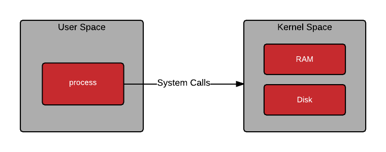

<h1 align="center">
    Kubernetes Concepts - From Zero to God
</h1>

<h1 align="center"> 
	🚧  🚀 Em construção...  🚧
</h1>

<h2 align="center">An Overview of Kubernetes Concepts</h2>

## Table of Contents
* [Basic Terminology](#basic-terminology)
* [Advanced Terminology](#advanced-terminology)
* [User space vs Kernel space](#User-space-vs-Kernel-space)
* [How user space affects your application](#How-user-space-affects-your-application)
* [Cgroup vs Namespaces](#Cgroup-vs-Namespaces)
* [Open Container Initiative Runtime Specification](#Open-Container-Initiative-Runtime-Specification)
* [Container Runtimes](#Container-Runtimes)
* [What's LXC, runC](#What's-LXC,-runC)
* [Container Engines](#Container-Engines)
* [What's Docker, Podman, CRI-O](#What's-Docker,-Podman,-CRI-O)
* [Kubernetes](#Kubernetes)
* [Plus](#plus)

## Basic Terminology
  - Container
  - Image
  - Container Image
  - Image Layer
  - Index
  - Registry
  - Repository
  - Tag
  - Base Image
  - Platform Image
  - Layer 
  - <a href="https://developers.redhat.com/blog/2016/01/13/a-practical-introduction-to-docker-container-terminology/">Link</a>

## Advanced Terminology 
  - Container Image Format
  - Container Engine - <a href="https://developers.redhat.com/blog/2018/02/22/container-terminology-practical-introduction/#h.6yt1ex5wfo3l">Link</a>
  - Container Host
  - Registry Server
  - Container Orchestration
  - Container Runtime - <a herf="https://developers.redhat.com/blog/2018/02/22/container-terminology-practical-introduction/#h.6yt1ex5wfo55">Link</a>
  - Kernel Namespace
  - Graph Driver
  - Container Use Cases
    - Application Containers
    - Operating System Containers
    - Pet Containers
    - Super Privileged Containers
  - Architecture of Containers
    - Application Images
    - Containerized  Components
    - Deployer Images
    - System Containers  
  - <a href="https://developers.redhat.com/blog/2018/02/22/container-terminology-practical-introduction/">Link</a>

## User space vs Kernel space
- Kernel Space: <a href="https://medium.com/@saschagrunert/demystifying-containers-part-i-kernel-space-2c53d6979504">Link</a>
- Understanding user space and kernel space: <a href="https://www.redhat.com/en/blog/architecting-containers-part-1-why-understanding-user-space-vs-kernel-space-matters">Link</a>

    

## How user space affects your application
- Understanding h ow user space affects your application: <a href="https://www.redhat.com/en/blog/architecting-containers-part-3-how-user-space-affects-your-application">Link</a>

    

    - A typical program gets access to resources in the kernel through layers of abstraction similar to the following diagram:
    

## Cgroup vs Namespaces
- Cgroup: Control Groups provide a mechanism for aggregating/partitioning sets of tasks, and all their future children, into hierarchical groups with specialized behaviour.
- Namespace: wraps a global system resource in an abstraction that makes it appear to the processes within the namespace that they have their own isolated instance of the global resource.

#### In short:

  - Cgroups = limits how much you can use
  - namespaces = limits what you can see (and therefore use)
    - <a href="https://pt.slideshare.net/jpetazzo/anatomy-of-a-container-namespaces-cgroups-some-filesystem-magic-linuxcon">Anatomy of a Container: Namespaces, cgroups & Some Filesystem Magic</a>

  - Cgroups involve resource metering and limiting:
    - memory
    - CPU
    - block I/O
    - network

  - Namespaces provide processes with their own view of the system:
    - pid
    - net
    - mnt
    - uts
    - ipc

## Open Container Initiative (OCI)
  - The Open Container Initiative develops specifications for standards on Operating System process and application containers: <a href="https://opencontainers.org/">Link</a>

## OCI Runtime Specification    
  - Open Container Initiative Runtime Specification: <a href="https://github.com/opencontainers/runtime-spec/blob/master/spec.md">Link</a>
  
    

## Low-Level and High-Level Container Runtimes
  - Why are Container Runtimes so Confusing? <a href="https://www.ianlewis.org/en/container-runtimes-part-1-introduction-container-r">Link</a> 
  - Why are Container Runtimes so Confusing, part 2? <a href="https://www.ianlewis.org/en/container-runtimes-part-2-anatomy-low-level-contai">Link</a> 
  - Why are Container Runtimes so Confusing, part 3? <a href="https://www.ianlewis.org/en/container-runtimes-part-3-high-level-runtimes">Link</a>
  - Why are Container Runtimes so Confusing, part 4? <a href="https://www.ianlewis.org/en/container-runtimes-part-4-kubernetes-container-run">Link</a>
    
    

## Container Runtimes

  - An Introduction to Container Runtimes: <a href="https://www.ianlewis.org/en/container-runtimes-part-1-introduction-container-r">Link</a>
  - A Comprehensive Container Runtime Comparison <a href="https://www.capitalone.com/tech/cloud/container-runtime/">Link</a>
  - Demystifying Containers <a href="https://medium.com/@saschagrunert/demystifying-containers-part-ii-container-runtimes-e363aa378f25">Link</a>

#### This is Important
  - *Container Engines = High-Level container runtime
  - *Container Runtime = Low-Level container runtime

  - *Low-Level container runtime: 
    - Low-Level container runtime implementes using Linux namespaces and cgroups. Namespaces let you virtualize system resources, like the file system or networking, for each container. Cgroups provide a way to limit the amount of resources like CPU and memory that each container can use. At the lowest level, container runtimes are responsible for setting up these namespaces and cgroups for containers, and then running commands inside those namespaces and cgroups. Low-level runtimes support using these operating system features.

       - What's runC? <a href="https://www.docker.com/blog/runc/">Link</a>
       - What's Kata Containers? <a href="https://katacontainers.io/">Link</a>
       - What's Nabla Containers? <a href="https://nabla-containers.github.io/">Link</a>

  - *High-Level container runtime:  
    - High-Level container runtime implements downloading images, managing them, and running containers from images. When it needs to run a container it unpacks the image into an OCI runtime bundle and shells out to runc to run it.
    
       - What's containerd (Docker)? <a href="https://containerd.io/docs/">Link</a>
       - What's CRI-O? <a href="https://cri-o.io/">Link</a>

  -  *Container Engines
        - A container engine is a piece of software that accepts user requests, including command line options, pulls images, and from the end user’s perspective runs the container. There are many container engines, including docker, CRI-O, and LXD: <a href="https://developers.redhat.com/blog/2018/02/22/container-terminology-practical-introduction/#h.6yt1ex5wfo3l">Link</a>
        - So, What Does A Container Engine Really Do Anyway? <a href="http://crunchtools.com/so-what-does-a-container-engine-really-do-anyway/">Link</a>

  
    <a href="https://docs.google.com/presentation/d/1OpsvPvA82HJjHN3Vm2oVrqca1FCfn0PAfxGZ2w_ZZgc/edit#slide=id.g2441f8cc8d_0_80">Two Types of People - Those Who Understand Container Standards and Those That Don't</a>

#### What's LXC, Docker, Podman
  - What's LXC? (LinuX Containers) <a href="https://linuxcontainers.org/lxc/introduction/">Link</a>
  - What's Docker? <a href="https://docs.docker.com/get-started/overview/">Link</a>
  - What's Podman? <a href="https://podman.io/getting-started/">Link</a>
    
    

## Container Runtime Interface (CRI)
  - Uncouple the Kubernetes from runtimes.
  - CRI was introduced in Kubernetes 1.5 and acts as a bridge between the kubelet and the High-Level Container Runtimes.

  - CRI: the Container Runtime Interface: <a href="https://github.com/kubernetes/kubernetes/blob/242a97307b34076d5d8f5bbeb154fa4d97c9ef1d/docs/devel/container-runtime-interface.md">Link</a>
  - Kubernetes Container Runtime Interface: <a href="https://www.alibabacloud.com/blog/getting-started-with-kubernetes-%7C-kubernetes-container-runtime-interface_596339">Link</a>

#### CRI Specification
  - CRI is a protocol buffers and gRPC API. The specification is defined in a protobuf file in the Kubernetes repository under the kubelet. CRI defines several remote procedure calls (RPCs) and message types. The RPCs are for operations like "pull image" (ImageService.PullImage). <a href="https://www.ianlewis.org/en/container-runtimes-part-4-kubernetes-container-run">Link</a>
    - What's Protocol Buffers?  <a href="https://www.ianlewis.org/en/container-runtimes-part-4-kubernetes-container-run">Link</a>
    - What's gRPC?  <a href="https://grpc.io/">Link</a>

    

#  Kubernetes
  - Kubernetes is removing docker support: <a href="https://www.openshift.com/blog/kubernetes-is-removing-docker-support-kubernetes-is-not-removing-docker-support">Link</a>

## kubelet 
  - The kubelet is an agent that sits on each worker node in the Kubernetes cluster. The kubelet is responsible for managing the container workloads for its node. <a href="https://www.ianlewis.org/en/container-runtimes-part-4-kubernetes-container-run">Link</a>

  -  What Is CRICTL And Why Should You Care? <a href="http://crunchtools.com/so-what-does-a-container-engine-really-do-anyway/">Link</a> 
  - cri (CRI)
    - cri is a containerd plugin implementation of Kubernetes container runtime interface (CRI) <a href="https://github.com/containerd/cri">Link</a>
    - cri-tools is a CLI and validation tools for Kubelet Container Runtime Interface (CRI). <a href="https://github.com/kubernetes-sigs/cri-tools">Link</a>

  

## -

# Plus

## Docker and LXD
  

## Docker Revolution
  - Docker Community Edition
  - Docker Compose
  - Docker Swarm
  - <a href="https://www.infoworld.com/article/3204171/what-is-docker-the-spark-for-the-container-revolution.html"> Link </a>

## Hello world!
   

