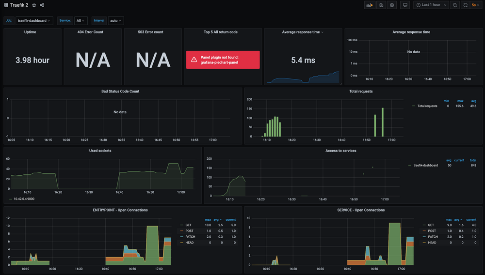

https://minikube.sigs.k8s.io/docs/start/

#### Minikube Tips
- minikube start
- minikube delete --all
- minikube stop
- minikube dashboard
- minikube tunnel

#### Imperative Commands
- kube get all
- kubectl delete horizontalpodautoscaler.autoscaling/scale-app
- kubectl delete -f .

# context
kubectl config view
kubectl config current-context

#IP dos containers
docker inspect -f '{{range .NetworkSettings.Networks}}{{.IPAddress}}{{end}} {{.Name}}' $(docker ps -aq)

kubectl get pods -l app=cattle

------------------------------------------------------------------------------------------------------------
######################
#  Imperativo 
######################

1)
kubectl create deployment hello-forward --image=k8s.gcr.io/echoserver:1.4
kubectl expose deployment hello-forward --type=NodePort --port=8080
kubectl port-forward service/hello-forward 7080:8080

2)
kubectl create deployment web-nodeport --image=k8s.gcr.io/echoserver:1.4
kubectl expose deployment web-nodeport --type=NodePort --port=8080
kubectl get service web-nodeport
minikube service web-nodeport --url

3)
kubectl create deployment balanced --image=k8s.gcr.io/echoserver:1.4  
kubectl expose deployment balanced --type=LoadBalancer --port=8080

4)
minikube tunnel

kubectl get services balanced

######################
## Declarativo
######################

0)
 eval $(minikube docker-env)

1)
 kube create -f namespace.json

2)
 kubectl get namespaces --show-labels
 kubectl config view

 kubectl config set-context dev --namespace=dev \
  --cluster=minikube \
  --user=minikube

 kubectl config get-contexts
 kubectl config use-context dev
 
 kube get all --all-namespaces
 kube get all -n default
 kube get all -n dev

3)
vi Dockerfile
--
FROM k8s.gcr.io/echoserver:1.4
MAINTAINER Cristiano Althoff

4)
docker build -t echobuild:dev0.1 .

5)
kube create -f app.yml
kube create -f vi service.yml

6)
minikube tunnel

7)
 minikube addons enable ingress

8)
kube create -f vi ingress.yml
kube get ing - default
kube describe ingress/ingress-hello

# 9) Scaling && Resource units in Kubernetes

## Requirements
  - Metrics Server must be reachable from kube-apiserver
  - The kube-apiserver must be correctly configured to enable an aggregation layer
  - Nodes must have kubelet authorization configured to match Metrics Server configuration
  - Container runtime must implement a container metrics RPCs
  - <a href="https://kubernetes.io/docs/concepts/configuration/manage-resources-containers/">link</a>

## apiVersion  
- apiVersion: autoscaling/v1 é o padrão e permite que você faça escalonamento automático com base apenas na utilização da CPU. Para fazer escalonamento automático com base em outras métricas, o uso de apiVersion: autoscaling/v2beta2 é recomendado. O exemplo em Como configurar uma implantação usa apiVersion: autoscaling/v1.

#### Tip
 - Heapster allows access to CPU and memory usage metrics for Kubernetes pods and nodes (At this time Heapster was about to be deprecated). 
 - Metrics-server aggregates resource consumption data like CPU and memory usage for Kubernetes nodes, pods and containers.
 - You can use Metrics Server for: <a href="https://github.com/kubernetes-sigs/metrics-server">Link</a>
    - CPU/Memory based horizontal autoscaling (learn more about Horizontal Pod Autoscaler)
    - Automatically adjusting/suggesting resources needed by containers (learn more about Vertical Pod Autoscaler)
 - Don't use Metrics Server when you need: <a href="https://github.com/kubernetes-sigs/metrics-server">Link</a>
    - Non-Kubernetes clusters
    - An accurate source of resource usage metrics
    - Horizontal autoscaling based on other resources than CPU/Memory

## Metrics-Server
 - Changed context of Kubernetes to Minikube.
  -  kubectl config use-context minikube
 - Enabled metrics-server and Disabled heapster in minikube.
  - minikube addons disable heapster
  - minikube addons enable metrics-server
  -  kubectl config use-context dev
 - Check it out 
  -  kube get all --all-namespaces
  -  kube top pod
  -  kube top node

#### Requests and limits
  -  
    - Memory ex: 128974848, 129e6, 129M, 123Mi, these values are the same value.
    - CPU ex: 0.1, 100m, one hundred millicpu.

#### Impperative Commands
- kubectl get hpa
- kubectl describe hpa scale-app
- kubectl describe hpa.v2beta2.autoscaling scale-app
- kubectl autoscale deployment nginx --cpu-percent=50 --min=1 --max=10
- kubectl scale deployment deploy-hello --replicas=3

## Horizontal Pod Autoscaler (HPA)
- <a href="https://kubernetes.io/docs/tasks/run-application/horizontal-pod-autoscale/">Link</a> 

## Vertical Pod Autoscaler (VPA)
- <a href="https://github.com/kubernetes/autoscaler/tree/master/vertical-pod-autoscaler">Link</a> 
- Vertical-pod-autoscaling:<a href="https://cloud.google.com/kubernetes-engine/docs/how-to/vertical-pod-autoscaling">Link</a> 
- Activating VPA dependencies: <a href="https://www.alibabacloud.com/help/doc-detail/173702.htm">Link</a>

- Setup VPA: <a href="https://docs.oracle.com/en-us/iaas/Content/ContEng/Tasks/contengusingverticalpodautoscaler.htm">Link</a>
- 1) kubectl config use-context minikube
- 2) kubectl -n kube-system get deployment/metrics-server
- 3) git clone -b vpa-release-0.8 https://github.com/kubernetes/autoscaler.git
- 4) cd autoscaler/vertical-pod-autoscaler
- 5) ./hack/vpa-down.sh
- 6) ./hack/vpa-up.sh
- 7) kubectl get pods -n kube-system
  - vpa-admission-controller-59d9965cfb-bzs8l 1/1 Running 0 6m34s
  - vpa-recommender-5bcb58569-mqdds 1/1 Running 0 6m43s
  - vpa-updater-5979cbf757-scw2d 1/1 Running 0 6m46s
- 8) kubectl config use-context dev  
- 9) kubectl create -f vpa/
- 10) watch
  - kubectl describe vpa hamster-vpa
  - kubectl get pods -l app=app-hello
  - kubectl describe pod hamster-96d4585b7-szg69
  - kubectl get --watch pods -l app=app-hello
  - kubectl describe vpa/hamster-vpa
- 11)
  - ab -k -c 250 -n 20000 http://localhost:8080/

## Vertical Pod Autoscaler (VPA) Advanced 
- <a href="https://kubernetes.io/docs/tasks/run-application/horizontal-pod-autoscale-walkthrough/">Link</a> 
- <a href="https://www.kloia.com/blog/advanced-hpa-in-kubernetes">Link</a> 

#### Scaling Behavior
- scaleDown,scaleUp: <a href="https://kubernetes.io/docs/tasks/run-application/horizontal-pod-autoscale/">Link</a> 

# 10) Monitoring, Logging, and Debugging

## Monitoring
- minikube dashboard
- Weave Scope: 
  - 1) kubectl config use-context minikube
  - 2) kubectl apply -f "https://cloud.weave.works/k8s/scope.yaml?k8s-version=$(kubectl version | base64 | tr -d '\n')"
  - 3) kubectl port-forward -n weave "$(kubectl get -n weave pod --selector=weave-scope-component=app -o jsonpath='{.items..metadata.name}')" 4040

## Logging, and Debugging
- <a href="https://kubernetes.io/docs/tasks/debug-application-cluster/">Link</a> 

#### Auditing
  <a href="https://kubernetes.io/docs/tasks/debug-application-cluster/audit/">Link</a> 

#### CRICTL
  - docker exec -it -u root minikube bash
  - VERSION="v1.20.0"
  - wget https://github.com/kubernetes-sigs/cri-tools/releases/download/$VERSION/crictl-$VERSION-linux-amd64.tar.gz
  - tar zxvf crictl-$VERSION-linux-amd64.tar.gz -C /usr/local/bin
  - rm -f crictl-$VERSION-linux-amd64.tar.gz
    - crictl pods
    - crictl images
    - crictl ps -a
    - crictl exec -i -t 5dcfb80c57e36 sh
    - crictl logs 5dcfb80c57e36
  <a href="https://kubernetes.io/docs/tasks/debug-application-cluster/crictl/">Link</a> 

## Monitoring with Prometheus and Traefik
  - <a href="https://traefik.io/blog/capture-traefik-metrics-for-apps-on-kubernetes-with-prometheus/">Link</a>
  - minikube start --kubernetes-version=v1.21.0
  - Install Helm 3 - <a href="https://helm.sh/docs/intro/install/">Link</a>
    - curl -fsSL -o get_helm.sh https://raw.githubusercontent.com/helm/helm/master/scripts/get-helm-3
    - chmod 700 get_helm.sh
    - ./get_helm.sh

  - Install Traefik:
    - helm install traefik traefik/traefik -n kube-system -f traefik-sre-metrics/traefik-values.yaml
    - kubectl apply -f traefik-sre-metrics/traefik-dashboard-service.yaml
    - kubectl port-forward service/traefik-dashboard 9000:9000 -n kube-system
    - http://localhost:9000/dashboard/#/
    - http://localhost:9000/metrics
    - helm uninstall traefik  
  
  - Install Prometheus:
    - helm repo add prometheus-community https://github.com/prometheus-community/helm-charts
    - helm search repo prometheus-community
    - helm install prometheus-stack prometheus-community/kube-prometheus-stack -n kube-system
    - kubectl apply -f traefik-sre-metrics/traefik-service-monitor.yaml -n default
    - kubectl port-forward service/prometheus-stack-kube-prom-prometheus 9090:9090 -n kube-system
    - kubectl apply -f traefik-sre-metrics/traefik-rules.yaml -n default
    - kubectl port-forward service/prometheus-stack-kube-prom-alertmanager 9093:9093 -n kube-system
    - http://localhost:9090/targets  
    - kubectl port-forward service/prometheus-stack-grafana 10080:80 kube-system
      - http://localhost:10080
      - User: admin, Pass: prom-operator
      - Click the Import button and input 11462

  - Generating some traffic:
    - kubectl apply -f traefik-sre-metrics/httpbin.yaml -n dev
    - kubectl port-forward service/httpbin 8000:8000
    - ab -c 5 -n 10000  -m PATCH -H "host:httpbin.local" -H "accept: application/json" http://localhost:8000/patch
    - ab -c 5 -n 10000  -m GET -H "host:httpbin.local" -H "accept: application/json" http://localhost:8000/get
    - ab -c 5 -n 10000  -m POST -H "host:httpbin.local" -H "accept: application/json" http://localhost:8000/post

  

## extra)
docker run -d -p 5000:5000 --restart=always --name registry registry:2
docker tag echobuild:dev0.1 localhost:5000/echobuild:dev0.1
docker push localhost:5000/echobuild:dev0.1
